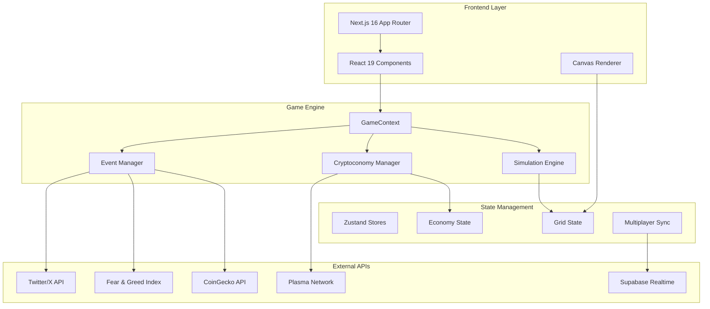
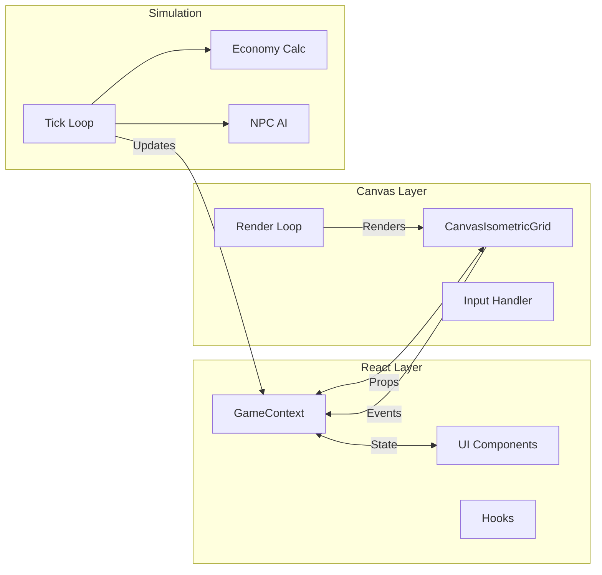
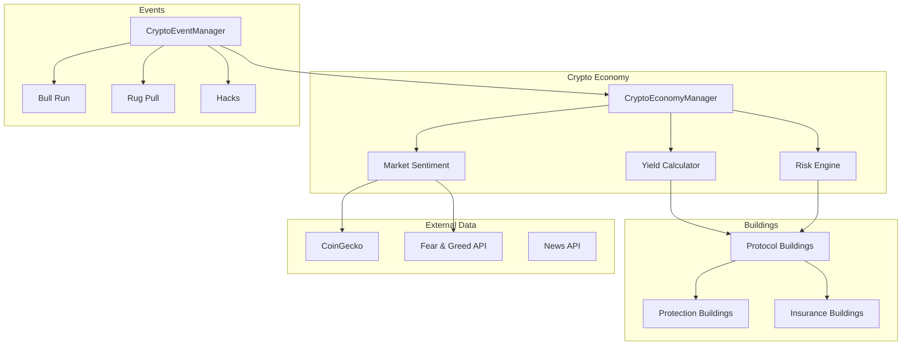

# 🏙️ CryptoCity

[](https://github.com/xkonjin/crypto-city/actions/workflows/ci.yml)
[](LICENSE)
[](https://nextjs.org/)
[](https://react.dev/)
[](https://www.typescriptlang.org/)

> An isometric city builder with DeFi integration. Build your crypto empire, manage yields, survive rug pulls, and compete on global leaderboards.

[🎮 Play Now](https://crypto-city-demo.vercel.app) • [📖 Documentation](docs/) • [🐛 Report Bug](../../issues) • [💡 Request Feature](../../issues)

---

## ✨ Overview

CryptoCity is a browser-based isometric city-building game that combines classic SimCity-style gameplay with cryptocurrency and DeFi mechanics. Players build and manage a city while investing in crypto protocols, managing yields, and navigating market volatility.

### Key Differentiators

- **Real Crypto Data**: Live market sentiment, prices, and events from CoinGecko, Fear & Greed Index
- **DeFi Integration**: Build protocol buildings (Uniswap, Aave, etc.) that generate yields
- **Risk/Reward Gameplay**: High-yield buildings carry rug pull risks
- **Multiplayer Co-op**: Build cities together with friends in real-time
- **Blockchain Ready**: Plasma network integration for on-chain features

---

## 🎮 Features

### Core City Building
- **Isometric Grid System**: Classic 2:1 isometric projection with proper depth sorting
- **Building System**: 100+ buildings across residential, commercial, industrial, and civic categories
- **Zoning & Simulation**: R/C/I zoning with demand-based growth (SimCity-style)
- **City Services**: Police, fire, health, education, power, water coverage systems
- **Budget Management**: Tax rates, service funding, monthly financial cycles
- **Transportation**: Roads, bridges, rail, subway with traffic simulation

### Crypto Economy
- **Protocol Buildings**: DeFi protocols (DEXs, lending, staking hubs) that generate yields
- **Yield Management**: Harvest yields manually or auto-compound
- **Market Sentiment**: Real Fear & Greed index affects building performance
- **Rug Pull System**: High-risk buildings can fail, requiring insurance and auditors
- **Trading System**: Invest in trade opportunities with risk/reward decisions
- **TVL Tracking**: Total Value Locked leaderboard rankings

### Social & Multiplayer
- **Co-op Mode**: Real-time collaborative city building with friends
- **Leaderboards**: Global rankings by TVL, population, and achievements
- **Referral System**: Invite friends for bonus rewards
- **Achievement Sharing**: Share milestones on social media
- **Weekly Challenges**: Time-limited objectives with exclusive rewards

### Advanced Systems
- **NPC Simulation**: AI citizens with schedules, needs, and activities
- **Event System**: Dynamic events (bull runs, bear markets, airdrops, hacks)
- **Disaster Management**: Fires, crime waves, and crypto-specific disasters
- **Prestige System**: Reset with permanent bonuses
- **Story Missions**: Guided narrative objectives

---

## 🏗️ Architecture

### System Overview



### Data Flow



### Crypto Economy Architecture



---

## 🛠️ Tech Stack

### Core Framework
| Technology | Version | Purpose |
|------------|---------|---------|
| [Next.js](https://nextjs.org/) | 16.1.1 | React framework with App Router |
| [React](https://react.dev/) | 19.2.1 | UI library |
| [TypeScript](https://www.typescriptlang.org/) | 5.x | Type-safe development |
| [Tailwind CSS](https://tailwindcss.com/) | 3.4.14 | Utility-first styling |

### Game & UI
| Technology | Purpose |
|------------|---------|
| [Canvas API](https://developer.mozilla.org/en-US/docs/Web/API/Canvas_API) | Isometric rendering |
| [Radix UI](https://www.radix-ui.com/) | Headless UI primitives |
| [Zustand](https://github.com/pmndrs/zustand) | State management |
| [SWR](https://swr.vercel.app/) | Data fetching & caching |

### Crypto & Web3
| Technology | Purpose |
|------------|---------|
| [Viem](https://viem.sh/) | Ethereum/EVM interactions |
| [Privy](https://www.privy.io/) | Wallet authentication |
| [Supabase](https://supabase.com/) | Realtime database |

### Testing & DevOps
| Technology | Purpose |
|------------|---------|
| [Playwright](https://playwright.dev/) | E2E testing |
| [ESLint](https://eslint.org/) | Code linting |
| [GitHub Actions](https://github.com/features/actions) | CI/CD |
| [Docker](https://www.docker.com/) | Containerization |

---

## 📁 Project Structure

```
crypto-city/
├── src/
│   ├── app/                    # Next.js App Router
│   │   ├── api/               # API routes (news, relay)
│   │   ├── coop/[roomCode]/   # Multiplayer rooms
│   │   ├── layout.tsx         # Root layout
│   │   └── page.tsx           # Landing page
│   ├── components/
│   │   ├── game/              # Core game components
│   │   │   ├── CanvasIsometricGrid.tsx  # Main renderer
│   │   │   ├── panels/        # UI panels (budget, stats, etc.)
│   │   │   └── canvas/        # Canvas subsystems
│   │   ├── crypto/            # Crypto-specific UI
│   │   ├── ui/                # shadcn/ui components
│   │   ├── mobile/            # Mobile-optimized UI
│   │   ├── wallet/            # Wallet integration
│   │   └── multiplayer/       # Co-op features
│   ├── context/               # React contexts
│   │   ├── GameContext.tsx    # Main game state
│   │   ├── EconomyContext.tsx # Economy state
│   │   └── MultiplayerContext.tsx
│   ├── games/isocity/         # Game engine types
│   │   ├── crypto/            # Crypto economy system
│   │   └── types/             # TypeScript definitions
│   ├── hooks/                 # Custom React hooks
│   ├── lib/                   # Utility libraries
│   │   ├── crypto/            # Crypto API clients
│   │   ├── npc/               # NPC AI systems
│   │   └── simulation.ts      # Core simulation
│   ├── core/                  # Core types (grid, rendering)
│   └── types/                 # Shared TypeScript types
├── public/                    # Static assets
│   ├── Building/             # Building sprites
│   ├── Tiles/                # Ground tiles
│   └── Characters/           # NPC animations
├── tests/                     # Playwright E2E tests
├── docs/                      # Documentation
├── scripts/                   # Build/deployment scripts
└── specs/                     # Feature specifications
```

---

## 🚀 Installation

### Prerequisites
- Node.js 20+
- npm or pnpm
- (Optional) Docker for containerized deployment

### Local Development

```bash
# Clone the repository
git clone https://github.com/xkonjin/crypto-city.git
cd crypto-city

# Install dependencies
npm install

# Set up environment variables
cp .env.example .env.local
# Edit .env.local with your API keys

# Run development server
npm run dev
```

Open [http://localhost:3000](http://localhost:3000) to start building.

### Docker Deployment

```bash
# Build and run with Docker Compose
docker-compose up -d

# Or build manually
docker build -t crypto-city .
docker run -p 3000:3000 crypto-city
```

---

## ⚙️ Environment Variables

Create a `.env.local` file with the following variables:

```env
# Required
NEXT_PUBLIC_PRIVY_APP_ID=your_privy_app_id

# Crypto Data APIs
NEXT_PUBLIC_COINGECKO_API_KEY=your_coingecko_api_key
NEXT_PUBLIC_PERPLEXITY_API_KEY=your_perplexity_key

# Blockchain (Plasma Network)
NEXT_PUBLIC_PLASMA_RPC=https://rpc.plasma.to
NEXT_PUBLIC_MERCHANT_ADDRESS=0xYourMerchantAddress
PLASMA_RELAYER_CREDENTIAL=your_relayer_credential

# Social (Optional)
NEXT_PUBLIC_TWITTER_BEARER_TOKEN=your_twitter_token
NANOBANANA_API_KEY=your_nanobanana_key
```

---

## 🧪 Usage Examples

### Basic Gameplay

```typescript
// Access game state
const { state, setTool, placeBuilding } = useGame();

// Place a building
setTool('building');
placeBuilding({ x: 10, y: 10, buildingId: 'uniswap-dex' });

// Access crypto economy
const { treasury, dailyYield, marketSentiment } = useCryptoEconomy();
```

### Crypto Economy Integration

```typescript
// Subscribe to economy updates
const unsubscribe = cryptoEconomy.subscribe((state) => {
  console.log('Treasury:', state.treasury);
  console.log('Daily Yield:', state.dailyYield);
  console.log('Market Sentiment:', state.marketSentiment);
});

// Harvest yields
const harvested = cryptoEconomy.harvestYields();

// Activate yield boost
cryptoEconomy.activateYieldBoost(buildingId, boostConfig);
```

### Multiplayer Co-op

```typescript
// Join a room
const { joinRoom, isHost, players } = useMultiplayerSync();

await joinRoom('ABC123');

// Broadcast building placement
broadcastPlace({ x: 5, y: 5, buildingId: 'aave-lending' });
```

---

## 🧪 Testing

```bash
# Run all tests
npm test

# Run with UI
npm run test:ui

# Run specific test
npx playwright test tests/game.spec.ts

# Type check
npx tsc --noEmit

# Lint
npm run lint
```

---

## 📊 Performance

- **Target**: 60 FPS on modern devices
- **Grid Size**: 48x48 tiles
- **NPC Budget**: 100 real NPCs + 500 simulated
- **Rendering**: Chunk-based with viewport culling
- **State**: Optimized with Zustand selectors

---

## 🗺️ Roadmap

See [ROADMAP.md](ROADMAP.md) for detailed development plans.

### Completed ✅
- [x] Isometric rendering engine
- [x] 100+ building types
- [x] Zoning & RCI simulation
- [x] Crypto economy system
- [x] Real market data integration
- [x] Multiplayer co-op
- [x] NPC simulation
- [x] Achievement system
- [x] Leaderboards

### In Progress 🚧
- [ ] Mobile app (React Native)
- [ ] Token rewards system
- [ ] NFT building skins
- [ ] DAO governance

### Planned 📋
- [ ] VR support
- [ ] AI city advisors
- [ ] Cross-chain bridges
- [ ] Tournament mode

---

## 🤝 Contributing

Contributions are welcome! Please read our [Contributing Guidelines](CONTRIBUTING.md) first.

### Development Workflow

1. Fork the repository
2. Create a feature branch (`git checkout -b feature/amazing-feature`)
3. Commit your changes (`git commit -m 'feat: add amazing feature'`)
4. Push to the branch (`git push origin feature/amazing-feature`)
5. Open a Pull Request

### Code Style

- **TypeScript**: Strict mode enabled
- **Naming**: PascalCase for components, camelCase for functions
- **Imports**: React → External → Internal → Relative → Types
- **No**: `as any`, `@ts-ignore`, empty catch blocks

---

## 📄 License

This project is licensed under the MIT License - see [LICENSE](LICENSE) for details.

**Exception**: Art assets in `/public` are NOT covered by this license. For released games, create or commission your own art assets.

---

## 🙏 Acknowledgments

- **SimCity 3000/4** - The gold standard for city simulation
- **RollerCoaster Tycoon** - Chris Sawyer's masterpiece
- **Cities: Skylines** - Modern city builder reference
- **Crypto Twitter** - For endless meme inspiration

---

## 📞 Support

- 📧 Email: support@cryptocity.game
- 💬 Discord: [Join our server](https://discord.gg/cryptocity)
- 🐦 Twitter: [@CryptoCityGame](https://twitter.com/CryptoCityGame)

---

<p align="center">
  Built with ❤️ and ☕ by the CryptoCity team
</p>
