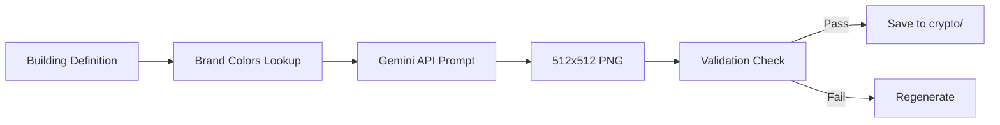
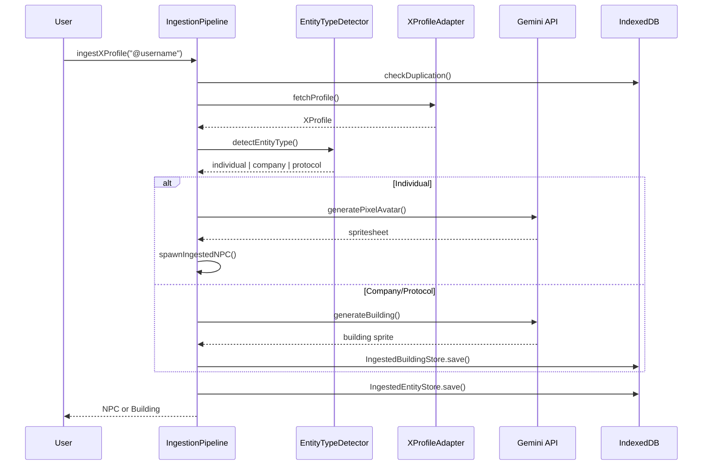

# CryptoCity Codebase Map

> Auto-generated by Cartographer | 2026-01-15 | 766 files | 2.25M tokens

A comprehensive guide to navigating the CryptoCity codebase - an isometric city builder with crypto economy integration.

---

## Quick Navigation

| System | Key Files | Tokens |
|--------|-----------|--------|
| [Core Game](#core-game-systems) | simulation.ts, GameContext.tsx | ~242k |
| [Rendering](#rendering-system) | CanvasIsometricGrid.tsx, drawing/* | ~213k |
| [Pixel Art/Sprites](#pixel-art--sprite-system) | public/Building/crypto/*, scripts/*.ts | ~150k |
| [NPC System](#npc-system) | lib/npc/*.ts | ~237k |
| [Titan/Pet](#titanpet-system) | lib/titan/*.ts | ~97k |
| [Crypto Economy](#crypto-economy) | crypto/buildings.ts, CryptoEconomyManager.ts | ~146k |
| [X Profile Ingestion](#x-profile-ingestion-system) | lib/ingestion/*.ts | ~45k |
| [UI Components](#ui-components) | panels/*.tsx, Sidebar.tsx | ~382k |
| [Visual Quality](#visual-quality-system) | validateSprite.ts, visual/*.spec.ts | ~30k |
| [Tests](#testing) | tests/*.spec.ts | ~537k |

---

## Architecture Overview

```
┌─────────────────────────────────────────────────────────────┐
│  LAYER 1: SIMULATION (React) - Source of Truth              │
│  Grid state, budget, population, time, zone growth          │
│  Files: GameContext.tsx, simulation.ts, EconomyContext.tsx  │
└─────────────────────┬───────────────────────────────────────┘
                      │ props/context (one-way)
                      ▼
┌─────────────────────────────────────────────────────────────┐
│  LAYER 2: RENDERING (Canvas) - Visualization                │
│  Multi-layer canvas, depth sorting, overlays                │
│  Files: CanvasIsometricGrid.tsx (3.5k lines)                │
└─────────────────────────────────────────────────────────────┘
                      │ reads grid
                      ▼
┌─────────────────────────────────────────────────────────────┐
│  LAYER 3: COSMETIC AGENTS - Eye Candy                       │
│  NPCs, vehicles, aircraft - read grid, never write          │
│  Files: NPCSimulation.ts, vehicleSystems hooks              │
└─────────────────────────────────────────────────────────────┘
```

**Golden Rule:** Simulation computes NUMBERS. Canvas shows PICTURES. Pictures never change numbers.

---

## Core Game Systems

### Files

| File | Lines | Purpose |
|------|-------|---------|
| `src/lib/simulation.ts` | ~6000 | Core simulation engine |
| `src/context/GameContext.tsx` | ~2300 | State management & persistence |
| `src/components/Game.tsx` | ~2200 | Main game UI component |
| `src/app/page.tsx` | ~600 | Entry point & landing page |
| `src/lib/cityAI/*.ts` | ~2500 | Autonomous city management |

### Simulation Engine

The simulation (`src/lib/simulation.ts`) handles:
- **Terrain Generation**: Perlin noise lakes/oceans, procedural tree placement
- **Building Evolution**: Multi-tier upgrades based on land value, services, demand
- **Service Coverage**: Police, fire, health, education with radius-based coverage
- **RCI Demand**: Residential/Commercial/Industrial demand with tax effects
- **Construction Progress**: Buildings have construction phases
- **Abandonment**: Buildings abandon with low demand, recover with positive

Key functions:
```typescript
createInitialGameState(size, cityName)  // Creates new game
simulateTick(state)                      // Advances simulation
placeBuilding(state, x, y, type, zone)   // Place building/zone
bulldozeTile(state, x, y)                // Remove building
hasRoadAccess(grid, x, y, size, max)     // BFS road connectivity
```

### State Management

`GameContext.tsx` provides:
- Complete game state (grid, stats, budget, services)
- `latestStateRef` - Mutable ref for immediate canvas updates
- Auto-save every 5 seconds with Web Worker compression
- Multi-city save management

Simulation loop pattern:
```
Every tick:
1. simulateTick(latestStateRef.current)
2. if (CityAI enabled) aiManager.tick()
3. Update latestStateRef immediately (canvas sees this)
4. Throttle React state updates to 500ms (UI refresh)
```

### City AI

The autonomous city management system (`src/lib/cityAI/`):

| Component | Purpose |
|-----------|---------|
| `CityAIManager.ts` | Singleton orchestration |
| `CityAssessor.ts` | City state analysis |
| `CityAIPlanner.ts` | Action planning |
| `BuildingPlacer.ts` | Placement scoring |

AI Goals: min happiness 50, max unemployment 15%, min power/water coverage 80%

---

## Rendering System

### Canvas Layers

6 separate canvases (bottom to top):

| Canvas | Purpose |
|--------|---------|
| Main | Base tiles, water, roads, bridges, rail |
| Hover | Selection/hover highlights |
| Cars | Ground vehicles, pedestrians |
| Buildings | Building sprites |
| Air | Aircraft, helicopters, fireworks |
| Lighting | Day/night overlay |

### Isometric Math

```typescript
const TILE_WIDTH = 64;
const HEIGHT_RATIO = 0.6;
const TILE_HEIGHT = TILE_WIDTH * HEIGHT_RATIO; // 38.4

// Grid → Screen
screenX = (gridX - gridY) * (TILE_WIDTH / 2);
screenY = (gridX + gridY) * (TILE_HEIGHT / 2);

// Depth sorting: diagonal sum method (sum = x + y)
```

### Entity Systems

| System | File | Features |
|--------|------|----------|
| Vehicles | `vehicleSystems.ts` | Cars, emergency vehicles, lane offsets |
| Pedestrians | `drawPedestrians.ts` | 15+ activities, 3 LOD levels |
| Trains | `trainSystem.ts` | Multi-carriage, Bezier curves |
| Aircraft | `seaplaneSystem.ts` | State machine: taxiing→flying→landing |

### Performance Optimizations

- **Viewport Culling**: Only render visible tiles
- **Pre-allocated Typed Arrays**: Eliminate GC for pathfinding
- **Dirty Region Tracking**: Partial redraws
- **LOD**: Reduce detail at low zoom
- **Mobile Limits**: Fewer cars, pedestrians, trains

---

## Pixel Art & Sprite System

The game uses AI-generated isometric pixel art sprites for all 127 crypto buildings, with a comprehensive validation and generation pipeline.

### Sprite Storage Structure

```
public/Building/crypto/
├── chain/           # L1/L2 blockchain buildings (13 sprites)
│   ├── 4x4ethereum_beacon_south.png
│   ├── 3x3solana_tower_south.png
│   └── ...
├── ct/              # Crypto Twitter culture (10 sprites)
├── defi/            # DeFi protocols (23 sprites)
├── exchange/        # CEX headquarters (7 sprites)
├── infrastructure/  # Oracles, bridges (7 sprites)
├── legends/         # Historical events (19 sprites)
├── meme/            # Meme coin culture (20 sprites)
├── plasma/          # Plasma ecosystem (18 sprites)
├── stablecoin/      # Stablecoin issuers (5 sprites)
└── titan/           # Hero Pet dwellings (5 sprites)
```

### Naming Convention

```
{width}x{height}{building_name}_{direction}.png

Examples:
- 4x4binance_tower_south.png  → 4×4 tile building, south-facing
- 2x2pepe_statue_south.png    → 2×2 tile building, south-facing
- 1x1plasma_node_south.png    → 1×1 tile building, south-facing
```

### Sprite Specifications

| Property | Value | Notes |
|----------|-------|-------|
| Base Dimensions | 512×512 px | Standard for all crypto buildings |
| Format | PNG | With alpha transparency |
| Background | Transparent | Corners must be transparent |
| Color Limit | ≤64 colors | For pixel art aesthetic |
| Min Transparency | ≥5% | Prevents solid backgrounds |

### Sprite Generation Scripts

Located in `scripts/`:

| Script | Purpose |
|--------|---------|
| `generateCryptoSprites.ts` | Main Gemini API generator with brand colors |
| `generateMissingSprites.ts` | Batch generation for missing sprites |
| `generateSpritesNanoBanana.ts` | Alternative Nano Banana API generator |
| `generateSpritesOpenAI.ts` | OpenAI DALL-E fallback generator |
| `regenerateBrokenSprites.ts` | Re-generate sprites with issues |
| `regeneratePlasmaBuildings.ts` | Plasma-specific with brand colors |
| `fixCryptoSprites.ts` | Background removal and fixes |
| `fixSpriteBackgrounds.py` | Python background cleanup (PIL) |
| `validateSprite.ts` | Validation CLI tool |

### Generation Pipeline



### Brand Colors Registry

Official brand colors in `generateCryptoSprites.ts`:

```typescript
const BRAND_COLORS = {
  // DeFi
  'uniswap': { primary: '#FF007A', secondary: '#FF007A' },
  'aave': { primary: '#B6509E', secondary: '#2EBAC6' },
  'ethereum': { primary: '#627EEA', secondary: '#3C3C3D' },
  'solana': { primary: '#9945FF', secondary: '#14F195' },
  'binance': { primary: '#F0B90B', secondary: '#1E2026' },
  'coinbase': { primary: '#0052FF', secondary: '#FFFFFF' },
  'plasma': { primary: '#569F8C', secondary: '#162F29' },
  // ... 50+ more protocols
};
```

### Sprite Loading Pipeline

```
buildingSprite.ts          → Source selection (normal/construction/abandoned)
     ↓
imageLoader.ts             → WebP optimization, caching, fallbacks
     ↓
placeholders.ts            → Colored placeholder while loading
     ↓
CanvasIsometricGrid.tsx    → Final canvas rendering
```

### Key Loading Files

| File | Purpose |
|------|---------|
| `buildingSprite.ts` | Sprite source selection, coordinate calculation |
| `imageLoader.ts` | WebP detection, caching, background filtering |
| `placeholders.ts` | Colored placeholders for missing/loading sprites |
| `renderConfig.ts` | Sprite pack configuration, coordinate mapping |

### Sprite Source Selection Priority

1. **Parks Construction** - Parks building under construction
2. **Construction** - Regular building, progress ≥40%
3. **Abandoned** - Building with `abandoned: true`
4. **Parks** - Recreation/park buildings
5. **Dense/Modern** - High-density variants
6. **Farm/Shop** - Low-density variants
7. **Normal** - Default sprite sheet

### Image Loading Features

- **WebP Optimization**: Auto-detects WebP support, falls back to PNG
- **Caching**: Map-based cache prevents duplicate loads
- **Fallback Placeholder**: Gray X pattern for missing assets
- **Load Notifications**: Callback system for re-renders on load

---

## Visual Quality System

Comprehensive sprite validation and visual regression testing.

### Sprite Validator CLI

`scripts/validateSprite.ts` - Node.js CLI using Sharp for pixel analysis.

```bash
# Validate single file or directory
npx ts-node scripts/validateSprite.ts public/Building/crypto/defi/

# Validate all crypto sprites
npx ts-node scripts/validateSprite.ts --all

# Generate HTML report
npx ts-node scripts/validateSprite.ts --report
```

### Validation Checks

| Check | Criteria | Score Impact |
|-------|----------|--------------|
| Dimensions | 512×512 expected | -25 per issue |
| Transparency | ≥5% transparent pixels | -25 per issue |
| Corner Pixels | ≥3/4 corners transparent | -15 if fail |
| Color Count | ≤64 unique colors | -10 warning |
| Solid Background | <1% transparency | Fails validation |

### Validation Result Structure

```typescript
interface SpriteValidationResult {
  valid: boolean;
  score: number;           // 0-100
  dimensions: { width, height, correct };
  transparency: {
    transparencyPercent: number;
    cornerPixelsTransparent: boolean;
  };
  colorAnalysis: {
    uniqueColors: number;
    dominantColors: string[];
  };
  issues: string[];
  warnings: string[];
}
```

### Visual Regression Tests

`tests/visual/sprite-rendering.spec.ts` - Playwright screenshot tests.

```typescript
// Tests verify:
// 1. Canvas layers render correctly
// 2. Crypto building panel shows icons
// 3. Building sprites have correct transparency
// 4. Pedestrians render on canvas
// 5. Vehicle animations progress
```

### Test Configuration

```typescript
await expect(canvas).toHaveScreenshot(name, {
  maxDiffPixels: 500,    // Allow animation variance
  threshold: 0.2,        // 20% pixel tolerance
});
```

### Sprite Test Panel

`SpriteTestPanel.tsx` - In-game sprite sheet viewer.

Features:
- View all sprite sheets (main, construction, abandoned, dense, modern, parks)
- Grid display with labels
- High-DPI rendering with crisp pixel art
- Tab navigation between sheets

---

## NPC System

### Architecture

```
src/lib/npc/
├── NPCSimulation.ts      # Master controller
├── LODManager.ts         # Level of detail (6 tiers)
├── NPCPersistence.ts     # Save/load
├── FamilyManager.ts      # Families, inheritance
├── InteractionManager.ts # Social interactions
├── PoliticalBeliefManager.ts # Political system
├── ThoughtEngine.ts      # Internal monologue
├── VectorMemoryManager.ts # Semantic memory
└── x402/                 # On-chain economy
```

### LOD Tiers

| Tier | Distance | Update Frequency | Features |
|------|----------|------------------|----------|
| FULL | Interacting | Every tick | Full AI, LLM |
| HIGH | <10 tiles | Every tick | Full AI, limited LLM |
| MEDIUM | <30 tiles | Every second | Simplified |
| LOW | <80 tiles | Every minute | Approximate |
| MINIMAL | <200 tiles | Statistical | Approximated |
| SUSPENDED | >200 tiles | None | Dormant |

### Memory System

1. **Episodic Memory**: Event-based with importance/emotional valence
2. **Semantic Memory**: General knowledge and facts
3. **Vector Memory**: TF-IDF embeddings with hybrid search (similarity + recency + importance)

### X402 Economy

NPCs can transact using x402 protocol:
- Each NPC gets HD wallet (derived from master seed)
- Services: drinks ($0.05), food ($0.10), alpha ($0.25), security ($0.50)
- Autonomous service seeking when needs low

---

## Titan/Pet System

### BDI AI Architecture

The Titan uses classic BDI (Belief-Desire-Intention):

```typescript
// Beliefs
worldKnowledge: Map<string, unknown>  // Max 200, LRU eviction
npcOpinions: Map<string, number>      // -1 to +1 scale
playerRelationship: { trust, fear, affection }

// Desires (computed from needs, mood, curiosity, commands)
// Intentions (goal + plan of max 5 actions)
```

### Learning System

- **Reinforcement Learning**: Praise/punish affects action beliefs
- **Training Window**: 3 seconds to reinforce/punish action
- **Observation Learning**: Titan watches NPCs and may mimic (5-60% chance)
- **Diminishing Returns**: Learning rate decreases with repetition

### Skills & Alignment

12 skills with XP progression:
- Physical: strength, speed, endurance
- Mental: intelligence, awareness, memory
- Social: charisma, intimidation, empathy
- Special: miracles, stealth, gathering

Alignment scale: -1.0 (angelic) to +1.0 (demonic)
- Visual morphing based on alignment
- 8 miracles with alignment requirements

### God Hand

Player interaction via `GodHandCursor.tsx`:
- `G` key: Toggle mode
- `P` key: Praise
- `U` key: Punish
- Mouse drag: Down = praise, Up = punish

---

## X Profile Ingestion System

The X Profile Ingestion system transforms Twitter/X profiles into in-game entities - either NPCs (individuals) or buildings (companies/protocols).

### Architecture

```
src/lib/ingestion/
├── IngestionPipeline.ts      # Main orchestration
├── EntityTypeDetector.ts     # Individual vs company detection
├── XProfileAdapter.ts        # X/Twitter API integration
├── socialAdapters.ts         # Firecrawl fallback adapter
├── PersonalityExtractor.ts   # NPC personality generation
├── traitMapping.ts           # Archetype → traits mapping
├── dialogueSeeds.ts          # NPC dialogue generation
├── safetyFilters.ts          # Content moderation
├── consent.ts                # User consent flow
├── AvatarGenerator.ts        # Pixel art sprite generation (Gemini API)
├── avatarQueue.ts            # Avatar job queue
├── BuildingGenerator.ts      # Company building sprite generation
├── IngestedNPCStore.ts       # IndexedDB persistence for NPCs
├── IngestedBuildingStore.ts  # IndexedDB persistence for buildings
├── IngestedEntityStore.ts    # Unified deduplication registry
└── spawnIngestedNPC.ts       # NPC spawn logic
```

### Ingestion Flow



### Key Components

| Component | Purpose |
|-----------|---------|
| `EntityTypeDetector` | Classifies X profiles as individuals, companies, or protocols using signals like bio keywords, follower ratios, verification status, and known protocol list |
| `BuildingGenerator` | Generates isometric pixel art buildings via Gemini API for ingested companies |
| `AvatarGenerator` | Creates 4-direction pixel art spritesheets for NPC characters |
| `IngestedEntityStore` | Unified deduplication registry preventing duplicate ingestions |
| `IngestedBuildingStore` | IndexedDB persistence for company buildings with sprite data |
| `IngestedNPCStore` | IndexedDB persistence for NPC data and avatar spritesheets |

### Entity Type Detection

The `EntityTypeDetector` uses multiple signals to classify profiles:

| Signal | Weight | Description |
|--------|--------|-------------|
| Known Protocol | 0.4 | Matches against 100+ known crypto protocols |
| Verified Org | 0.3 | X organization verification |
| Bio Keywords | 0.15 | "protocol", "exchange", "platform", etc. |
| Website URL | 0.1 | Domain patterns (.io, .finance, etc.) |
| Official Tone | 0.1 | Formal language patterns |

### Building Generation

For companies/protocols, buildings are generated with:
- **Tier**: Based on follower count (retail < degen < whale < institution)
- **Footprint**: Larger tiers get bigger buildings (up to 3x3)
- **Chain Detection**: Bio analysis for blockchain affiliation
- **Effects**: Yield rates, synergies based on profile metrics

### Persistence

All ingested entities use IndexedDB with three stores:
1. **ingestion-registry**: Unified deduplication (username → record)
2. **ingested-npcs**: NPC data + avatar spritesheets
3. **ingested-buildings**: Building data + sprites

### UI Panel

`FindMyCharacterPanel.tsx` allows users to:
- View all ingested NPCs
- Pan camera to character location
- Delete ingested characters
- See character details (archetype, occupation, wallet)

---

## Crypto Economy

### Building Categories

| Category | Count | Examples |
|----------|-------|----------|
| DeFi | 23 | Aave, Uniswap, Lido, Pendle |
| Exchange | 7 | Binance, Coinbase, Kraken |
| Chain | 13 | Ethereum, Solana, Arbitrum, Base |
| CT | 10 | Influencer studios, VC offices |
| Meme | 20 | Pepe, Doge, BONK, WIF |
| Plasma | 18 | Custom game-branded buildings |
| Stablecoin | 5 | Tether, Circle, Ethena |
| Infrastructure | 7 | Chainlink, The Graph, Auditors |
| Legends | 15 | FTX Ruins, Luna Crater |

### Tier System

| Tier | Yield | Risk | Cost | Notes |
|------|-------|------|------|-------|
| Retail | 3-10% | 0.1-1% | $1k-5k | Stable |
| Degen | 15-40% | 2-10% | $3k-8k | Contagion risk |
| Whale | 10-25% | 0.5-2% | $8k-15k | Moderate |
| Institution | 5-15% | 0.1-0.5% | $15k-35k | Stability bonus |

### Synergy Mechanics

- **Chain Synergy**: +5% per same-chain building nearby
- **Category Synergy**: +3% per same-category building
- **Cap**: 50% maximum bonus

### Risk & Protection

- Rug pulls can damage buildings (0 yield until repaired)
- Security Auditor: -25% rug risk in 3-tile radius
- Crypto Insurance: 50% loss recovery in 4-tile radius

### Real-World Data

Fear & Greed Index affects yields:
| Range | Multiplier |
|-------|-----------|
| 0-20 (Extreme Fear) | 0.5x |
| 40-60 (Neutral) | 1.0x |
| 80-100 (Extreme Greed) | 1.5x |

---

## UI Components

### Panel System

21 dialog panels in `src/components/game/panels/`:

| Panel | Purpose |
|-------|---------|
| `AdvisorsPanel` | City advisor recommendations |
| `BudgetPanel` | Financial management |
| `ChallengesPanel` | Weekly challenges |
| `CityAIPanel` | Autonomous AI settings |
| `DisasterPanel` | Disaster management |
| `EconomyStatsPanel` | Crypto economy stats |
| `EventsPanel` | City events log |
| `FinancialReportPanel` | Detailed reports |
| `FindMyCharacterPanel` | Ingested NPC manager |
| `LeaderboardPanel` | City rankings |
| `MilestonePanel` | Achievement milestones |
| `NPCInspectorPanel` | NPC details viewer |
| `OrdinancePanel` | City ordinances |
| `PetitionsPanel` | Citizen petitions |
| `PrestigePanel` | Prestige system |
| `ReferralPanel` | Referral program |
| `SettingsPanel` | Game settings |
| `SpriteTestPanel` | Sprite sheet viewer |
| `StatisticsPanel` | City statistics |
| `TileInfoPanel` | Tile inspector |

Pattern: `<Dialog open={true} onOpenChange={() => setActivePanel('none')}>`

### Crypto UI Components

Located in `src/components/crypto/`:

| Component | Purpose |
|-----------|---------|
| `CryptoBuildingPanel` | Building selection with progressive disclosure |
| `FilterChips` | Chain/tier/risk filter system |
| `BuildingSearch` | Fuzzy search with highlighting |
| `CategoryCard` | Category collapse/expand cards |
| `TierGroup` | Tier-based building grouping |
| `RiskBadge` | Visual risk indicators |
| `PortfolioAnalytics` | Portfolio performance charts |
| `LiveDataIndicator` | Real-time data status |
| `NewsTicker` | Scrolling crypto news |

### Design Tokens

Key CSS variables in `globals.css`:
```css
--background: 220 20% 8%;     /* Dark blue-gray */
--foreground: 210 20% 92%;    /* Light gray */
--primary: 210 60% 60%;       /* Mild blue */
--accent: 173 58% 39%;        /* Teal */
```

### Mobile Patterns

- `MobileToolbar.tsx`: Fixed bottom toolbar with expandable menu
- `MobileTopBar.tsx`: Compact stats with expandable details
- Min tap targets: 44x44px
- Safe area insets via CSS variables

### Cobie Companion

Floating head with:
- Expression states (happy, sad, excited, skeptical)
- Speech bubbles with dialogue
- Interaction menu
- Settings: position, size, talkativeness

Integration via `useFloatingCobie` hook with event triggers.

---

## Testing

114 test files, 537k tokens, 3,791+ tests passing

### Test Categories

| Category | Files | Focus |
|----------|-------|-------|
| Core Game | game.spec.ts | Basic functionality |
| NPC | npc*.spec.ts (20+) | Simulation, memory, interactions |
| Titan | titan*.spec.ts (21) | AI, learning, skills, miracles |
| Crypto | crypto*.spec.ts | Buildings, economy |
| UI | panel specs | Component behavior |

### Running Tests

```bash
npm run test           # All tests
npm run test:ui        # Interactive UI
npx playwright test tests/game.spec.ts  # Single file
npx playwright test -g "pattern"        # By name
```

---

## Directory Structure

```
src/
├── app/                     # Next.js App Router
│   ├── page.tsx            # Landing + Game container
│   └── globals.css         # Design tokens
├── components/
│   ├── game/               # Core game components (~85 files)
│   │   ├── CanvasIsometricGrid.tsx  # Main renderer (3.7k lines)
│   │   ├── buildingSprite.ts        # Sprite source selection
│   │   ├── imageLoader.ts           # Image caching/loading
│   │   ├── placeholders.ts          # Fallback placeholders
│   │   ├── drawing.ts               # Base tile drawing
│   │   ├── drawPedestrians.ts       # NPC rendering
│   │   ├── drawAircraft.ts          # Aircraft rendering
│   │   ├── Sidebar.tsx              # Building tools
│   │   ├── panels/                  # 21 dialog panels
│   │   └── cobie/                   # Cobie companion
│   ├── ui/                 # shadcn/ui (20 files)
│   ├── crypto/             # Crypto-specific UI (15 files)
│   ├── mobile/             # Mobile variants
│   └── titan/              # Hero Pet components
├── lib/
│   ├── simulation.ts       # Core sim (6k lines)
│   ├── npc/                # NPC simulation (32 files)
│   ├── titan/              # Hero Pet (17 files)
│   ├── cityAI/             # Autonomous city management
│   ├── ingestion/          # X Profile ingestion (16 files)
│   └── crypto/             # Crypto utilities
├── games/isocity/
│   ├── crypto/             # Crypto economy
│   │   ├── buildings.ts    # 127 building definitions
│   │   ├── CryptoEconomyManager.ts
│   │   └── types.ts
│   └── types/              # Game type definitions
├── context/                # React contexts
│   ├── GameContext.tsx     # Main state hub
│   └── EconomyContext.tsx
└── hooks/                  # Custom hooks (40 files)

public/
├── Building/
│   ├── crypto/             # 127 crypto building sprites
│   │   ├── chain/          # 13 L1/L2 blockchain sprites
│   │   ├── ct/             # 10 Crypto Twitter sprites
│   │   ├── defi/           # 23 DeFi protocol sprites
│   │   ├── exchange/       # 7 CEX sprites
│   │   ├── infrastructure/ # 7 oracle/bridge sprites
│   │   ├── legends/        # 19 historical sprites
│   │   ├── meme/           # 20 meme coin sprites
│   │   ├── plasma/         # 18 Plasma ecosystem sprites
│   │   ├── stablecoin/     # 5 stablecoin sprites
│   │   └── titan/          # 5 Hero Pet dwelling sprites
│   ├── residential/        # Residential building sheets
│   ├── commercial/         # Commercial building sheets
│   ├── civic/              # Civic building sheets
│   └── landmark/           # Landmark sprites
├── Characters/             # NPC spritesheets
├── Tiles/                  # Base tile textures
├── cars/                   # Vehicle sprites
└── UI/                     # UI elements

scripts/
├── generateCryptoSprites.ts     # Gemini sprite generator
├── generateMissingSprites.ts    # Batch generation
├── generateSpritesNanoBanana.ts # Nano Banana API
├── regenerateBrokenSprites.ts   # Re-generation tool
├── validateSprite.ts            # Validation CLI
├── fixCryptoSprites.ts          # Background fixes
└── fixSpriteBackgrounds.py      # PIL background cleanup
```

---

## Key Patterns

1. **Singleton Pattern**: CryptoEconomyManager, CityAIManager, TitanManager, IngestedEntityStore
2. **Ref-based Performance**: `latestStateRef` for canvas, React state for UI
3. **Web Worker Offloading**: Serialization/compression off main thread
4. **Throttled Updates**: React state synced every 500ms
5. **LOD Optimization**: Distance-based update frequency
6. **BDI Architecture**: Titan AI with Belief-Desire-Intention
7. **IndexedDB Persistence**: Ingested NPCs and buildings survive page refreshes
8. **Pipeline Pattern**: IngestionPipeline orchestrates multi-stage entity creation

---

## Commands

```bash
npm run dev      # Development (localhost:3000)
npm run build    # Production build
npm run lint     # ESLint
npm run test     # Playwright tests
```

---

## Dependencies

**Core:** Next.js 16, React 19, TypeScript 5, Tailwind CSS 4
**UI:** Radix UI, shadcn/ui, lucide-react
**State:** React Context, localStorage (lz-string compression), IndexedDB (idb)
**Game:** Canvas 2D, gifuct-js (GIF animations)
**AI/Generation:** Gemini API (avatar & building sprites)
**Testing:** Playwright
